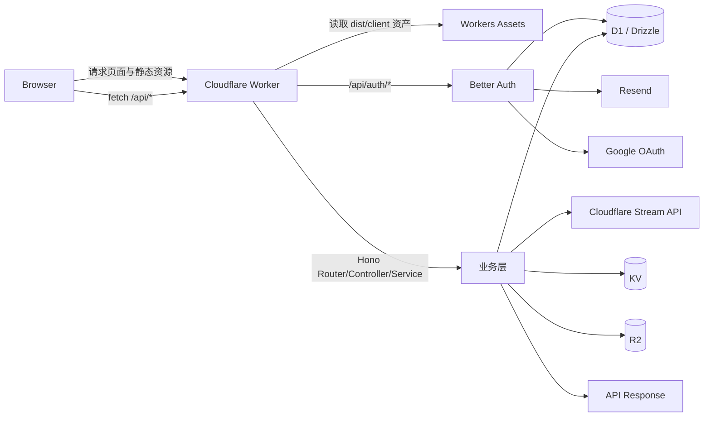

# Illumi Family MVP 技术架构文档

## 0. 文档信息
- 项目：`illumi-family-mvp`
- 文档版本：`v1.4.0`
- 最近更新：`2026-04-17`
- 运行规范入口：`docs/runbooks/development-deployment-cicd-runbook.md`
- 当前阶段：模板初始化后已完成 UI 基础设施 + 前端路由/数据缓存（TanStack Router + Query）+ 后端基础能力（dev/prod + D1/KV/R2 + Drizzle + Hono API 分层）+ Better Auth + Resend 鉴权主链路（邮箱密码 + Google）+ Admin CMS 基础能力（白名单鉴权 + admin 子域 + D1 内容版本化 + R2 资产 + 内容发布 API）+ i18n Phase 1/2（前端双语、CMS locale、内容 fallback、locale 缓存分片）+ Cloudflare Stream 视频能力层（后台直传签发 + 导入复用、webhook 状态回写、发布门禁、公网播放）+ 首页关键区块后台可编辑化（Slogan + 核心视频 + 动态角色视频、shared 双 locale 镜像发布）+ 本地模板脚手架（template:new/sync/doctor）

## 1. 架构目标与边界
本项目采用 **React + Vite + Hono + Cloudflare Workers** 的一体化架构，目标是在 Cloudflare 边缘网络上实现：
- 前端 SPA 静态资源分发；
- Worker 侧 API 能力（通过 Hono 路由）；
- 单仓开发、单次构建、统一部署。

当前仓库处于 MVP 迭代阶段，已引入鉴权体系与身份映射模型，业务域仍在持续扩展中。
当前已落地后端基础层：`dev/prod` 环境分层、D1/KV/R2 绑定、Drizzle schema/migration、Hono 分层路由骨架、`health/users/auth` 模块，以及 Better Auth 驱动的 `/api/auth/*` 能力。

## 2. 技术栈（当前实际版本）
- 前端框架：`react@19.2.1`、`react-dom@19.2.1`
- 前端路由与数据层：`@tanstack/react-router@^1.163.3`、`@tanstack/react-query@^5.90.21`
- 国际化与格式化：`i18next@^25.8.18`、`react-i18next@^16.5.8`、`dayjs@^1.11.20`
- 构建工具：`vite@^6.0.0`
- 服务端框架：`hono@4.11.1`
- 平台与部署：`wrangler@4.56.0`、Cloudflare Workers
- 包管理器：`pnpm@10.10.0`
- 数据层与验证：`drizzle-orm@0.45.1`、`drizzle-kit@0.31.9`、`zod@4.3.6`、`@hono/zod-validator@0.7.6`
- 鉴权与邮件：`better-auth@1.5.3`、`resend@6.9.3`
- UI 与样式：`tailwindcss@^4.2.1`、`@tailwindcss/vite@^4.2.1`、`tw-animate-css@^1.4.0`
- 组件体系：`shadcn/ui`（本地组件模式 + `components.json`） 、`@base-ui/react@^1.2.0`
- 关键插件：`@cloudflare/vite-plugin@1.15.3`、`@vitejs/plugin-react@5.1.1`
- 视频播放：`@cloudflare/stream-react@1.9.3`
- 测试与质量：`vitest@4.0.18`、`typescript@5.8.3`、`eslint@9.39.2`

## 3. 总体架构


### 3.1 运行时职责划分
- React 应用负责页面渲染与交互；
- Worker 作为统一入口：
  - 提供 API 路由（`/api/health`、`/api/users`、`/api/auth/*`、`/api/admin/content/home*`、`/api/admin/videos/*`、`/api/content/home`、`/api/content/videos`、`/api/webhooks/stream`、`/api/`）；
  - 通过 Router/Controller/Service/Repository 分层处理请求；
  - 接入 D1（关系型）、KV（缓存/轻配置）、R2（对象存储）；
  - 通过 Stream 集成层对接 Cloudflare Stream（直传 URL 签发 + 状态同步）；
  - 托管并分发构建后的前端资源（`dist/client`）。

### 3.2 核心请求路径
1. 用户访问站点根路径，Worker 返回 SPA 入口资源。
2. 前端触发 `fetch("/api/*")`。
3. Hono 路由进入统一中间件（request-id、错误处理、校验）。
4. Controller 调 Service，Service 调 Repository（Drizzle/D1）或 KV/R2 访问层。
5. 视频链路通过 integration 层调用 Stream API，并由 `/api/webhooks/stream` 回写处理状态。
6. 返回统一 JSON 响应结构（`success/data/error/requestId`）。

## 4. 代码结构与模块职责
```text
.
├── components.json         # shadcn/ui 组件脚手架配置
├── template.config.json    # 模板同步白/黑名单与替换规则
├── tools/
│   └── create-illumi-family-app/
│       ├── create.mjs      # template:new / template:doctor
│       ├── sync-template.mjs
│       └── templates/base/ # 模板快照目录（含 manifest）
├── src/
│   ├── react-app/          # 前端 SPA
│   │   ├── main.tsx        # React 启动入口
│   │   ├── router.tsx      # TanStack Router 路由树与 QueryClient
│   │   ├── routes/         # 页面路由组件（home/users/auth/admin/admin-videos）
│   │   ├── components/ui/  # shadcn 组件目录
│   │   ├── components/video/ # 视频播放弹窗组件
│   │   ├── lib/            # 前端工具方法与 API/Query/Auth client 配置
│   │   └── *.css, assets/  # 样式与静态资源
│   └── worker/
│       ├── index.ts        # Hono Worker 导出入口
│       ├── app.ts          # Hono app 组装（middleware + route + error）
│       ├── types.ts        # Worker Bindings 与 Context 类型
│       ├── config/env.ts   # APP_ENV/API_VERSION 运行时读取
│       ├── modules/        # 领域模块（health/users/auth/admin/content/video）
│       └── shared/         # 跨模块能力（http/db/storage/auth/email/integrations）
├── drizzle.config.ts       # Drizzle Kit 配置
├── drizzle/migrations/     # Drizzle SQL 迁移文件
├── wrangler.json           # Worker 部署与资产托管配置
├── vite.config.ts          # Vite + Cloudflare 插件配置
├── vitest.config.ts        # 全仓 Vitest 测试配置（Worker API + 前端 API client）
├── tsconfig.*.json         # 前端/Worker/Node 配置拆分
└── docs/                   # 架构与设计文档
```

### 4.1 前端 UI 基础设施说明
- Tailwind v4 采用 CSS-first 模式，入口样式文件为 `src/react-app/index.css`。
- TanStack Router 负责前端页面路由管理，当前已落地 `home/users/auth/admin/videos` 页面路由。
- TanStack Query 负责 server-state 请求、缓存与失效刷新，当前示例接入 `/api/health` 与 `/api/users`。
- 视频播放页采用 `@cloudflare/stream-react` 组件，配合 `VideoPlayerModal` 弹窗完成公网播放。
- shadcn/ui 采用本地组件模式：
  - 组件规范文件：`components.json`；
  - 通用工具：`src/react-app/lib/utils.ts`（`cn`）。
- Base UI 以 primitive 方式使用（当前示例：`Switch`），用于低层可组合交互组件。
- alias 统一为 `@ -> src/react-app`，在 `vite.config.ts` 与 `tsconfig*.json` 中同时配置。

### 4.2 Admin CMS 与 Video 能力代码落点
- `src/worker/modules/admin/*`：后台白名单鉴权后的内容管理与资产上传 API。
- `src/worker/modules/content/*`：公网内容读取与资产回源 API。
- `src/worker/modules/video/*`：视频上传签发、状态同步、生命周期管理与公网视频读取 API。
- `src/worker/shared/integrations/stream/*`：Stream API 与 webhook 校验封装。
- `src/worker/shared/db/schema/cms.ts`：CMS 主档/版本/资产/关联表定义。
- `src/worker/shared/db/schema/video.ts`：视频能力层表结构定义（`video_assets`）。
- `src/worker/shared/auth/admin-access.ts`：硬编码白名单与邮箱归一化逻辑。

## 5. 配置基线（Cloudflare 侧）
`wrangler.json` 当前关键配置：
- `main: "./src/worker/index.ts"`：Worker 入口；
- `compatibility_date: "2025-10-08"`：运行时兼容基准；
- `compatibility_flags: ["nodejs_compat"]`：启用 Node 兼容能力；
- `workers_dev: true`：启用 `workers.dev` 访问；
- `observability.enabled: true`：启用可观测性；
- `assets.directory: "./dist/client"`：将前端构建产物作为静态资产；
- `assets.not_found_handling: "single-page-application"`：SPA 回退路由策略。
- `assets.run_worker_first: ["/api/*"]`：仅 API 请求先进入 Worker，前端路由由资产层处理。
- Stream 运行配置（通过 vars/secrets 注入）：
  - `STREAM_ACCOUNT_ID`
  - `STREAM_API_TOKEN`（secret）
  - `STREAM_WEBHOOK_SECRET`（secret）
- `routes` / `env.dev.routes`：自定义域名路由（prod=`illumi-family.com` + `admin.illumi-family.com`，dev=`dev.illumi-family.com` + `admin-dev.illumi-family.com`）。
- 顶层（prod）绑定：
  - D1: `illumi-family-db`
  - KV: `ILLUMI_CACHE`
  - R2: `illumi-family-files`
  - Vars: `APP_ENV=prod`、`API_VERSION=v1`、`BETTER_AUTH_BASE_URL`、`RESEND_FROM_EMAIL`
- `env.dev` 绑定：
  - Worker 名称：`illumi-family-mvp-dev`
  - D1: `illumi-family-db-dev`
  - KV: `ILLUMI_CACHE_DEV`
  - R2: `illumi-family-files-dev`
  - Vars: `APP_ENV=dev`、`API_VERSION=v1`、`BETTER_AUTH_BASE_URL`、`RESEND_FROM_EMAIL`

### 5.1 环境区分架构（重点）
- 环境区分基于 **Cloudflare Worker 环境配置**，不是基于 Git 分支。
- 当前采用两层：
  - `prod`：`wrangler.json` 顶层配置；
  - `dev`：`wrangler.json` 的 `env.dev` 配置。
- 两个环境拥有独立 Worker 名称与独立资源绑定（D1/KV/R2），从架构上实现数据与流量隔离。

### 5.2 当前环境映射表（本项目）
| 维度 | prod | dev |
| --- | --- | --- |
| Wrangler scope | 顶层配置 | `env.dev` |
| Worker name | `illumi-family-mvp` | `illumi-family-mvp-dev` |
| `APP_ENV` | `prod` | `dev` |
| D1 | `illumi-family-db` | `illumi-family-db-dev` |
| KV | `ILLUMI_CACHE` | `ILLUMI_CACHE_DEV` |
| R2 | `illumi-family-files` | `illumi-family-files-dev` |
| Primary URL | `https://illumi-family.com` | `https://dev.illumi-family.com` |
| Admin URL | `https://admin.illumi-family.com` | `https://admin-dev.illumi-family.com` |
| workers.dev fallback URL | `https://illumi-family-mvp.lguangcong0712.workers.dev` | `https://illumi-family-mvp-dev.lguangcong0712.workers.dev` |

### 5.3 环境使用方式（命令级）
1. 开发与联调（本地）
- `pnpm dev`（默认使用 dev 环境）
- `pnpm run dev:prod`（需要按 prod 绑定启动时显式使用）

2. 部署前检查
- dev（默认）: `pnpm run check`
- dev（兼容）: `pnpm run check:dev`
- prod（显式）: `pnpm run check:prod`

3. 部署
- dev（默认）: `pnpm run deploy`
- dev（显式）: `pnpm run deploy:dev`
- prod（显式）: `pnpm run deploy:prod`

4. 数据迁移
- dev（默认）: `pnpm run db:migrate`
- dev（显式）: `pnpm run db:migrate:dev`
- local（本地 dev）: `pnpm run db:migrate:local`
- prod（显式）: `pnpm run db:migrate:prod`

### 5.4 与 Git 分支的关系
- Git 分支是代码协作机制；Cloudflare 环境是运行时隔离机制。
- 分支与环境可以建立团队约定（例如 `main -> prod`, `develop -> dev`），但不是平台强制关系。
- 即使在同一分支，也可以通过不同部署命令把同一份代码发到不同环境。

### 5.5 local / dev / prod 资源隔离明细（D1 / KV / R2 / Stream）
> 结论先行：`dev` 与 `prod` 为远端独立绑定；`local` 运行时默认本地模式（非 `--remote`），因此 D1/KV/R2 不会直接写入远端环境。

| 资源维度 | local（`pnpm dev`） | dev（远端） | prod（远端） | 隔离/共用结论 |
| --- | --- | --- | --- | --- |
| Worker 运行目标 | `CLOUDFLARE_ENV=dev vite`，本地开发 runtime | `wrangler deploy --env dev` | `wrangler deploy --env=""` | 三者运行位点不同；local 不等于远端 dev |
| D1 | 本地 D1（`db:migrate:local` = `--env dev --local`） | `illumi-family-db-dev` | `illumi-family-db` | 三者隔离 |
| KV | 本地 KV（Wrangler 本地持久化，默认 `.wrangler/state`） | `ILLUMI_CACHE_DEV` | `ILLUMI_CACHE` | 三者隔离 |
| R2 | 本地 R2（Wrangler 本地持久化，默认 `.wrangler/state`） | `illumi-family-files-dev` | `illumi-family-files` | 三者隔离 |
| Stream API（上传签发/状态同步/删除） | 通过 `fetch` 直连 Cloudflare Stream API（依赖本地变量） | Cloudflare Stream API（dev secret/vars） | Cloudflare Stream API（prod secret/vars） | 非本地模拟；会访问真实 Stream 服务 |
| Stream Account | 取 `.dev.vars(.dev)` 中 `STREAM_ACCOUNT_ID` | `wrangler.json -> env.dev.vars.STREAM_ACCOUNT_ID` | `wrangler.json -> vars.STREAM_ACCOUNT_ID` | 当前配置下 dev/prod 为同一 account id（共享账户级资源池） |

补充说明：
- 本仓库脚本未使用 `wrangler dev --remote`；因此 `pnpm dev` 默认不直接连接远端 D1/KV/R2。
- `STREAM_WEBHOOK_SECRET` 为各环境 secret：local 从 `.dev.vars(.dev)` 注入，dev/prod 通过 `wrangler secret put ...` 管理。

## 6. 构建、开发与部署链路
### 6.1 本地开发
- `pnpm dev`
- 默认通过 `CLOUDFLARE_ENV=dev` 加载 `wrangler.json -> env.dev` 绑定。
- 如需按 prod 绑定启动，使用 `pnpm run dev:prod`。

### 6.2 构建
- `pnpm build`
- 执行 `tsc -b && vite build`，产出前端静态资源（供 Worker 资产托管）。

### 6.3 部署
- dev（默认）: `pnpm run deploy`
- prod（显式）: `pnpm run deploy:prod`
- 通过 Wrangler 将 Worker 代码与静态资产发布到目标环境。
- `deploy:prod` 对应 `wrangler deploy --config wrangler.json --env=""`，显式指向顶层 prod 配置，避免多环境提示歧义。

### 6.4 集成检查
- `pnpm check`
- 运行 `tsc && vite build && wrangler deploy --dry-run --config wrangler.json --env dev`，用于 dev 目标（默认）部署前自检。
- `pnpm run check:dev`
- 运行 `wrangler deploy --dry-run --config wrangler.json --env dev`，用于 dev 目标快速绑定校验。
- `pnpm run check:prod`
- 运行 `tsc && vite build && wrangler deploy --dry-run --config wrangler.json --env=""`，用于 prod 目标部署前自检。

### 6.5 数据迁移与测试
- `pnpm db:generate`：基于 Drizzle schema 生成 SQL migration
- `pnpm run db:migrate`：默认将 migration 应用到 `env.dev` 远程 D1（先执行）
- `pnpm run db:migrate:dev`：显式对 `env.dev` 执行 migration
- `pnpm run db:migrate:local`：对本地 `dev` D1 应用 migration（`wrangler --local`），用于本地 `pnpm dev` 缺表修复
- `pnpm db:migrate:prod`：将 migration 应用到 prod 远程 D1（后执行）
- `pnpm test`：运行 Worker API + 前端 API client 测试（Vitest）

### 6.6 本地模板脚手架链路
- `pnpm template:sync`：默认 dry-run，对比白名单源文件与模板快照差异，不落盘。
- `pnpm template:sync -- --apply --force`：将白名单文件同步到 `templates/base`，并生成 `template.manifest.json`。
- `pnpm template:doctor`：校验脚本、模板目录、manifest 与关键模板文件完整性。
- `pnpm template:new -- --name my-app --dir ../my-app --no-install`：从模板快照生成新项目，并替换 `package.json.name` 与 `wrangler.json` 的 Worker 名称。
- 模板同步规则由 `template.config.json` 管理，当前采取白名单复制 + 黑名单排除策略，避免影响主线开发目录。

### 6.7 鉴权运行时约束（坑点固化）
- Cloudflare Worker 的 CPU 时间预算受限，邮箱密码链路若采用高开销哈希参数，可能触发 `503/1102`（`Worker exceeded CPU time limit`）。
- 当前实现已在 Better Auth `emailAndPassword.password` 注入 `PBKDF2(SHA-256)` 哈希器（`src/worker/shared/auth/password-hasher.ts`），用于满足 Worker 运行时预算。
- 后续若调整密码哈希算法或参数，必须做最小回归：
  1. `POST /api/auth/sign-up/email` 与 `POST /api/auth/sign-in/email` 端到端验证；
  2. 观察 `wrangler tail` 是否出现 CPU 超限；
  3. 运行 `src/worker/shared/auth/password-hasher.test.ts` 对应测试。

### 6.8 开发与部署规范入口
- 本地/`dev`/`prod` 的完整手册见：
  - `docs/runbooks/development-deployment-cicd-runbook.md`
- 该手册覆盖：环境区分、手动 CI/CD、迁移治理、参数变更、回滚、AI 代理执行协议。

## 7. 当前能力与后续演进位
### 7.1 已具备能力
- 前端页面渲染与基础交互；
- 前端路由切换（TanStack Router）；
- 前端 server-state 查询、缓存与失效刷新（TanStack Query）；
- Worker API 分层处理（Router/Controller/Service/Repository）；
- Better Auth 鉴权主链路（邮箱密码 + 邮箱验证 + Google OAuth）；
- Admin 白名单鉴权中间件（`requireAdminSession`）与管理域访问控制；
- CMS 数据层（`cms_entries` / `cms_revisions` / `cms_assets` / `cms_entry_assets`）；
- 公网内容发布接口（`/api/content/home`）与 admin 内容管理接口（`/api/admin/content/home`）；
- i18n Phase 1/2 能力：前端 `zh-CN/en-US` 切换、`/api/content/home?locale=` 契约、`cms_entries(entry_key, locale)` 维度、内容 fallback 与 `fallbackFrom`；
- locale 缓存分片与发布失效矩阵：`cms:home:published:v1:{locale}`，共享首页 key 发布时联动失效全部受支持 locale；
- 首页关键区块后台可编辑能力：
  - shared entry keys：`home.hero_slogan`、`home.main_video`、`home.character_videos`；
  - shared key save/publish 镜像写入 `zh-CN/en-US`；
  - 发布门禁覆盖 Slogan 必填、核心视频必填、角色视频至少 1 条、视频 `ready + published` 二次校验；
  - 首页首段/视频入口改为消费发布配置（`heroSlogan` + `featuredVideos`），移除固定 6 槽位常量依赖；
- R2 资产上传与读取链路（`/api/admin/assets/upload`、`/api/content/assets/:assetId`）；
- Cloudflare Stream 视频能力层：
  - admin 直传 URL 签发（`POST /api/admin/videos/upload-url`）；
  - admin 复用导入（`POST /api/admin/videos/import`，仅落当前环境 D1）；
  - webhook 状态回写（`POST /api/webhooks/stream`）；
  - 视频生命周期管理（list/edit/publish/unpublish/sync）；
  - 行为日志字段（`actionType`、`streamVideoId`、`operator`、`env`）用于区分“新上传”与“导入复用”；
  - 公网视频列表与播放（`GET /api/content/videos` + `/videos` 弹窗播放器）；
- 业务用户身份映射与审计模型（`app_users`、`user_identities`、`user_security_events`）；
- `dev/prod` 双环境与独立自定义域名（`illumi-family.com` / `dev.illumi-family.com` / `admin.illumi-family.com` / `admin-dev.illumi-family.com`）+ workers.dev 回退域名；
- D1/KV/R2 数据存储绑定；
- Drizzle schema + migration 流程；
- 统一错误响应与 request-id 中间件；
- 前后端同域部署链路与 Cloudflare 平台可运行配置。
- 本地模板脚手架链路（`template:new` / `template:sync` / `template:doctor`）。
- dev 环境鉴权基准域名已切换为自定义域名（`https://dev.illumi-family.com`）。

### 7.2 待引入能力（后续配置阶段可扩展）
- 手机号 OTP 登录（当前仅预留数据与配置位）；
- 更完整的业务域模型（families/tasks 等）；
- 视频能力层与业务内容模块（如 stories）编排集成；
- 细粒度鉴权、审计日志、限流；
- 扩展更多 custom domain（如 `api/admin/cms`）与证书路由策略；
- CI/CD 自动化发布策略。

## 8. 文档维护规则（后续必须同步）
当出现以下变更时，必须同步更新本文档：
1. 技术栈与版本策略变化（如 React/Vite/Hono/Wrangler 升级）。
2. 目录结构变化（新增 `src/server`、`src/shared` 等）。
3. Worker 配置变化（`wrangler.json` 字段调整）。
4. 请求链路变化（API 前缀、网关层、鉴权流程等）。
5. 构建/部署命令变化（脚本或 CI 流程变更）。

建议维护方式：
- 每次配置改动的 PR 同步修改本文件；
- 在文档末尾追加变更记录；
- 若架构发生中等以上变化，同步新增 `docs/plans/*` 设计说明并引用。

## 9. 变更记录
| 日期 | 版本 | 变更摘要 |
| --- | --- | --- |
| 2026-03-04 | v0.1.0 | 初始化架构基线文档，覆盖当前模板实况与维护规则 |
| 2026-03-04 | v0.2.0 | 新增 Tailwind v4、shadcn/ui 与 Base UI 配置基线，补充 alias 与前端组件目录说明 |
| 2026-03-04 | v0.3.0 | 包管理器从 npm 迁移到 pnpm，更新脚本与常用命令说明 |
| 2026-03-04 | v0.4.0 | 落地后端基础能力：dev/prod 环境分层、D1/KV/R2 绑定、Drizzle migration、Hono API 分层与 users/health 示例 |
| 2026-03-04 | v0.5.0 | 新增“环境区分架构与使用方式”章节，明确环境不是按 Git 分支而是按 Wrangler 环境与部署命令区分，并补充环境映射表与命令规范 |
| 2026-03-04 | v0.6.0 | 前端分阶段接入 TanStack Router + Query，新增多页面路由与 Query 缓存/失效刷新能力（明确未引入 Start/Table/Form/Virtual） |
| 2026-03-04 | v0.7.0 | 调整脚本策略为“默认 dev、显式 prod”：`dev/check/deploy/db:migrate` 默认走 dev，并新增 `*:prod` 显式命令 |
| 2026-03-05 | v0.8.0 | 新增本地模板脚手架实现：`template:new`、`template:sync`、`template:doctor`、模板快照与 manifest 管理 |
| 2026-03-05 | v0.9.0 | 落地 Better Auth + Resend 鉴权主链路：`/api/auth/*`、邮箱密码与 Google 登录、身份映射与安全审计表、前端 Auth 路由与会话守卫 |
| 2026-03-05 | v0.9.1 | dev 环境 `BETTER_AUTH_BASE_URL` 切换至 `https://dev.illumi-family.com`，用于 Google OAuth 回调与同域鉴权流程 |
| 2026-03-05 | v0.9.2 | prod 环境 `BETTER_AUTH_BASE_URL` 切换至 `https://illumi-family.com`，并在 `wrangler.json` 落地 `dev/prod` custom domain routes |
| 2026-03-06 | v1.0.0 | 落地 Admin CMS 基础架构：admin 子域路由、白名单鉴权中间件、D1 CMS 表结构、`/api/content/home` 与 `/api/admin/*` 接口、R2 资产链路 |
| 2026-03-05 | v0.9.3 | assets 路由策略收敛为 `run_worker_first: ["/api/*"]`，修复 verify-email 回跳后 `/users` 前端路由 Not Found |
| 2026-03-05 | v0.9.4 | 固化鉴权运行时坑点：记录 Worker CPU 1102 风险与密码哈希参数调整回归要求（PBKDF2 方案） |
| 2026-03-17 | v1.0.1 | 新增中英双语国际化规划入口：在“待引入能力”补充 i18n 目标与详细方案文档链接（`docs/plans/2026-03-17-i18n-architecture-plan.md`） |
| 2026-03-18 | v1.1.0 | i18n Phase 1/2 已落地（前端双语 + API/CMS locale + 缓存分片），并新增开发部署运行规范（`docs/runbooks/development-deployment-cicd-runbook.md`） |
| 2026-04-16 | v1.2.0 | 新增 Cloudflare Stream 视频能力层：后台直传签发、webhook 状态回写、发布门禁、公网视频列表与弹窗播放，并同步更新文档与 runbook |
| 2026-04-17 | v1.3.0 | 新增 Stream 视频导入复用链路：`POST /api/admin/videos/import`、环境内幂等落库与上传/导入行为日志字段 |
| 2026-04-17 | v1.4.0 | 首页关键区块后台可编辑化：新增 `home.hero_slogan` / `home.main_video` / `home.character_videos` shared 配置、发布门禁、首页配置驱动渲染 |
