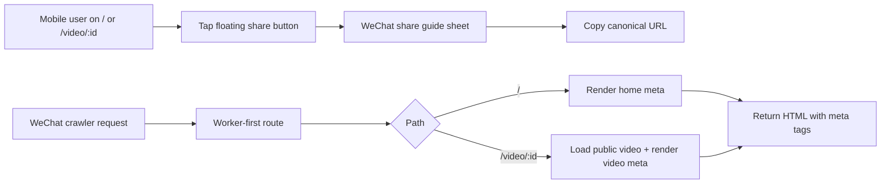

# feat: mobile wechat share entry and video seo cards

## Overview

在首页与视频页交付移动端右下角分享入口，并为微信分享建立可抓取、可区分的卡片能力。  
本计划采用“前端交互入口 + Worker 输出可抓取 meta”的混合方式：  
- 前端负责分享按钮、微信指引浮层、复制链接体验。  
- Worker 负责首页与视频详情页的动态卡片元信息输出，确保微信抓取链路稳定读取。  

## Problem Frame

当前站点虽有全局静态 meta，但无法按具体视频输出独立卡片，且移动端缺少低摩擦分享入口。  
用户已在 origin 文档中明确本期优先级：微信场景优先、视频独立路径优先、`description` 用统一模板、`image` 优先视频封面回退默认图（see origin: `docs/brainstorms/2026-05-04-mobile-wechat-share-seo-cards-requirements.md`）。

## Requirements Trace

- 移动端悬浮分享入口与交互：R1, R2, R3
- 分享链接主路径规范：R4, R5
- 首页与视频页卡片三要素：R6, R7
- 微信抓取稳定性（不依赖客户端 JS 执行）：R8

## Scope Boundaries

- 本期仅覆盖微信分享闭环，不接入其他社媒 SDK/渠道能力。
- 本期不新增后台视频独立 description 编辑字段；description 采用统一模板。
- 本期不做全站 SEO 体系升级，仅覆盖首页与视频详情页卡片链路。
- 不改动视频发布数据模型，仅消费既有公开视频信息。

## Context & Research

### Relevant Code and Patterns

- 前端路由与页面：
  - `src/react-app/router.tsx`
  - `src/react-app/routes/home-page.tsx`
  - `src/react-app/routes/videos-page.tsx`
  - `src/react-app/routes/root-layout.tsx`
- 视频路由工具与测试：
  - `src/react-app/lib/video-watch-route.ts`
  - `src/react-app/lib/video-watch-route.test.ts`
  - `src/react-app/routes/videos-page.test.tsx`
- Worker API 与视频数据访问：
  - `src/worker/app.ts`
  - `src/worker/modules/video/public-video.controller.ts`
  - `src/worker/modules/video/video.service.ts`
  - `src/worker/modules/video/video.repository.ts`
  - `src/worker/types.ts`
- 资产路由配置：
  - `wrangler.json`
- 现有 SEO 相关文档与先前计划：
  - `docs/plans/2026-04-15-001-feat-seo-technical-architecture-plan.md`

### External References

- Cloudflare Workers static assets `run_worker_first` selective routing（官方文档，2026-03/04 更新）用于本次首页与视频路径的 worker-first 控制。
- TanStack Router v1 path params（官方文档）用于 `"/video/$streamVideoId"` 路由语义与类型约束。

## Key Technical Decisions

- 决策 1：视频分享 canonical 链接采用 `"/video/{streamVideoId}"`，并在客户端将旧 query 链接收敛到 canonical 路径。
- 决策 2：移动端分享入口做成复用组件，挂载在首页与视频详情页，避免页面各自实现导致体验漂移。
- 决策 3：微信卡片 meta 由 Worker 在请求阶段输出（首页 + 视频详情页），不依赖客户端运行后再改 meta。
- 决策 4：视频卡片 description 使用统一模板生成函数，集中管理，后续可平滑升级为后台字段。
- 决策 5：视频卡片 image 优先 `posterUrl`，为空或异常时回退默认图并输出绝对 URL。

## Open Questions

### Resolved During Planning

- [Affects R4,R5] 路由形态采用 path 参数 `"/video/$streamVideoId"` 作为主分享链路，保留 `/video` 作为可选兜底入口。
- [Affects R8] 微信抓取链路通过 worker-first 路由 + 服务端 meta 输出保证可读性，不走“纯 CSR 动态改 meta”。
- [Affects R7] description 首发使用统一模板，不新增后台维护成本。

### Deferred to Implementation

- [Affects R7][Needs research] description 模板的最终中英文文案长度（需在真实微信卡片中验证截断表现）。
- [Affects R6,R7][Technical] 默认分享图素材最终文件路径与尺寸是否需要新增专用资源。

## High-Level Technical Design

## Implementation Units

- [ ] **Unit 1: Public video URL contract migration to path-based canonical**

**Goal:** 让公开视频分享链路从 query 形态收敛到 path 形态，为视频独立卡片打基础。

**Requirements:** R4, R5

**Dependencies:** None

**Files:**
- Modify: `src/react-app/router.tsx`
- Modify: `src/react-app/routes/videos-page.tsx`
- Modify: `src/react-app/lib/video-watch-route.ts`
- Modify: `src/react-app/lib/video-watch-route.test.ts`
- Modify: `src/react-app/routes/videos-page.test.tsx`
- Modify: `src/react-app/routes/home-page.tsx`

**Approach:**
- 新增或调整公开视频路由到 `"/video/$streamVideoId"`（并按需要保留 `/video` 兜底）。
- 更新 `buildPublicVideoWatchHref` 输出 canonical path，而非 query 形式。
- 在视频页读取 path param 作为第一来源，并对历史 query 链接做兼容收敛（replace 到 canonical）。

**Patterns to follow:**
- 现有 `video-watch-route` 的“解析 + 回退首个视频”策略。
- `router.tsx` 现有 `createRoute` 组织方式与类型安全写法。

**Test scenarios:**
- Happy path: 首页点击视频进入 `"/video/{streamVideoId}"`。
- Edge case: 访问旧 `"/video?v=..."` 链接时，页面可正常播放并收敛到 canonical URL。
- Edge case: streamVideoId 不存在时回退首个可播放视频且 URL 修正。

**Verification:**
- 公共视频链接在前端全链路统一为 path canonical，减少分享链接歧义。

- [ ] **Unit 2: Mobile floating share entry and WeChat guide sheet**

**Goal:** 在首页与视频详情页建立一致的移动端分享入口和微信内指引交互。

**Requirements:** R1, R2, R3, R5

**Dependencies:** Unit 1

**Files:**
- Create: `src/react-app/components/share/mobile-share-fab.tsx`
- Create: `src/react-app/components/share/wechat-share-sheet.tsx`
- Create: `src/react-app/components/share/share-utils.ts`
- Modify: `src/react-app/routes/home-page.tsx`
- Modify: `src/react-app/routes/videos-page.tsx`
- Test: `src/react-app/components/share/mobile-share-fab.test.tsx`
- Test: `src/react-app/routes/home-page.test.tsx`
- Test: `src/react-app/routes/videos-page.test.tsx`

**Approach:**
- 抽象可复用分享入口组件，统一控制“仅移动端展示”规则。
- 点击后展示微信分享指引浮层，包含文案提示与复制链接动作。
- 复制逻辑统一走 `share-utils`，优先复制 canonical URL。

**Patterns to follow:**
- 现有页面级交互状态与 `useEffect` 生命周期处理风格（`home-page.tsx`、`videos-page.tsx`）。
- 现有 UI 组件库使用方式（保持 `src/react-app/components/ui` 风格）。

**Test scenarios:**
- Happy path: 移动端条件下首页、视频页均可见分享按钮。
- Happy path: 点击按钮弹出指引浮层并可复制当前 canonical 链接。
- Edge case: 复制 API 不可用时，回退策略（如选择文本/错误提示）行为可预期。
- Regression: 桌面端不显示 FAB，不影响现有导航与主内容交互。

**Verification:**
- 用户在移动端 2 步内完成“点击分享 -> 获取可转发链接”。

- [ ] **Unit 3: Worker-first dynamic SEO cards for home and video detail**

**Goal:** 为 `"/"` 与 `"/video/:streamVideoId"` 输出服务端可抓取的卡片 meta。

**Requirements:** R6, R7, R8

**Dependencies:** Unit 1

**Files:**
- Create: `src/worker/modules/seo/seo.router.ts`
- Create: `src/worker/modules/seo/seo.controller.ts`
- Create: `src/worker/modules/seo/seo.service.ts`
- Create: `src/worker/modules/seo/seo.service.test.ts`
- Modify: `src/worker/app.ts`
- Modify: `src/worker/types.ts`
- Modify: `src/worker/index.test.ts`
- Modify: `wrangler.json`

**Approach:**
- 在 `wrangler.json` 中将首页与视频详情页纳入 `assets.run_worker_first` 选择性路径。
- Worker 新增 SEO 路由：  
  - `/`：输出首页卡片 meta  
  - `/video/:streamVideoId`：读取公开视频信息，输出视频卡片 meta
- `seo.service` 统一构建 meta：title/description/image、canonical、og/twitter 字段，含默认图回退与绝对 URL 规范。
- 对视频不存在或未发布场景定义稳定降级策略（如默认站点卡片或 404 语义，按实现阶段定稿）。

**Patterns to follow:**
- `src/worker/modules/content` 的 Router -> Controller -> Service 分层风格。
- `VideoService`/`VideoRepository` 的公开视频读取与缓存模式。

**Test scenarios:**
- Happy path: 请求首页返回包含首页 title/description/image 的 HTML meta。
- Happy path: 请求 `"/video/{validId}"` 返回该视频 title + 模板 description + poster/default image。
- Edge case: `posterUrl` 为空时回退默认图且为绝对 URL。
- Edge case: 无效视频 ID 时 meta 降级策略与状态码符合预期。
- Integration: `/api/*` 路由行为不回归，SPA 资产请求不被错误拦截。

**Verification:**
- 微信抓取链路无需客户端 JS 即可拿到首页/视频差异化卡片信息。

- [ ] **Unit 4: Regression hardening, rollout guardrails, and docs sync**

**Goal:** 补齐回归保障、发布验证与文档同步，降低上线风险。

**Requirements:** R1-R8

**Dependencies:** Unit 2, Unit 3

**Files:**
- Modify: `docs/core/technical-architecture.md`
- Modify: `.codex/skills/illumi-family-project-playbook/references/current-state.md`
- Modify: `.codex/skills/illumi-family-project-playbook/references/workflows.md` (仅当命令或验证流程变化)

**Approach:**
- 增加路由与卡片行为的关键回归测试（前端 + Worker）。
- 形成发布后手工验收清单：移动端按钮可用、复制链接正确、微信内卡片验证。
- 同步更新架构文档与项目 playbook 引用，满足仓库同步规则。

**Test scenarios:**
- End-to-end smoke: 首页分享、视频分享两条链路可用。
- Regression: root-layout 现有 public/auth/admin 导航显示逻辑不被破坏。
- Contract: Worker 路由新增后，既有 health/auth/content/video API 返回契约不变。

**Verification:**
- 上线后可通过固定 checklist 快速判断“分享入口 + 卡片抓取”是否健康，并具备明确回滚点。

## System-Wide Impact

- **Routing contract:** 公开视频路径从 query 主语义迁移到 path canonical，会影响外链生成与历史链接兼容逻辑。
- **Worker/asset boundary:** 需引入 selective worker-first 路径，改变首页与视频详情页请求处理顺序。
- **SEO surface:** 首页与视频页卡片信息由静态统一值升级为按页面/视频动态输出。
- **Testing surface:** 新增 UI 交互与 Worker HTML meta 断言，测试范围跨前后端边界。

## Risks & Mitigations

| Risk | Mitigation |
| --- | --- |
| worker-first 配置错误导致公开页面无法回退到 SPA 资产 | 仅对白名单路径启用，先在 dev 验证，再逐步发布；保留可快速回滚的 wrangler 配置点 |
| 视频不存在时返回策略不清晰，影响分享体验或状态码语义 | 在 Unit 3 明确无效视频降级策略并以测试固化 |
| 复制链接在部分移动端浏览器权限受限 | `share-utils` 提供多级回退并在 UI 提示失败路径 |
| 默认图路径或域名不一致导致卡片取图失败 | 统一在 `seo.service` 做绝对 URL 规范化并加测试 |

## Rollback Points

- 回滚点 1：`wrangler.json` 的 `assets.run_worker_first` 路径配置（可先退回仅 `/api/*`）。
- 回滚点 2：前端分享入口挂载（可临时下线 FAB，不影响核心播放流程）。
- 回滚点 3：视频 path canonical 逻辑（保留 query 兼容可作为应急兜底）。

## Review Addendum (2026-05-04)

本轮实现后审查结论：**暂缓上线**，先保留分支备份，后续二次收敛再发布。  
主要风险结论如下：

- P1 性能风险：`assets.run_worker_first` 扩展到 `/` 与 `/video/*` 后，首页与视频详情页不再走纯静态入口，均增加 Worker 处理开销；`/video/{id}` 还会触发公开视频读取与 HTML meta 重写，可能抬高 TTFB。
- P1 行为风险：无效 `streamVideoId` 在 Worker SEO 路由下直接返回 404，与前端既有“回退首个可播视频”的容错语义不一致，可能影响历史坏链访问体验。
- P2 稳定性风险：dev fallback HTML 依赖 `@react-refresh` preamble；若生产环境异常命中 fallback，需要确保不会触发运行时不兼容。

后续建议：
- 将 SEO worker-first 控制收敛为“爬虫/分享场景优先”，普通用户访问尽量保持静态快路径；
- 明确无效视频 ID 的统一降级策略（站点卡片 / 回退播放 / 404）并在前后端保持一致；
- fallback HTML 分离 dev/prod 模式，避免环境耦合。

## Sources & References

- Origin: `docs/brainstorms/2026-05-04-mobile-wechat-share-seo-cards-requirements.md`
- Related plans:
  - `docs/plans/2026-04-15-001-feat-seo-technical-architecture-plan.md`
  - `docs/plans/2026-05-01-004-feat-video-route-realignment-plan.md`
- Primary code anchors:
  - `src/react-app/router.tsx`
  - `src/react-app/routes/home-page.tsx`
  - `src/react-app/routes/videos-page.tsx`
  - `src/react-app/lib/video-watch-route.ts`
  - `src/worker/app.ts`
  - `src/worker/modules/video/video.service.ts`
  - `wrangler.json`
